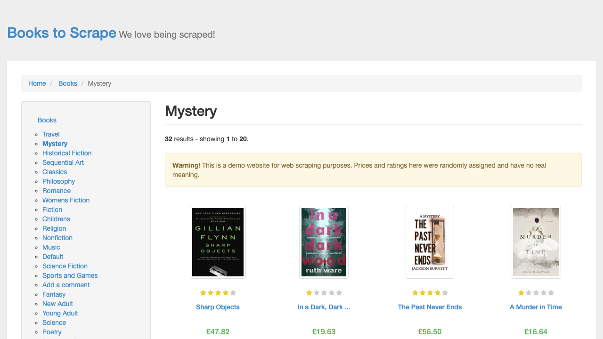
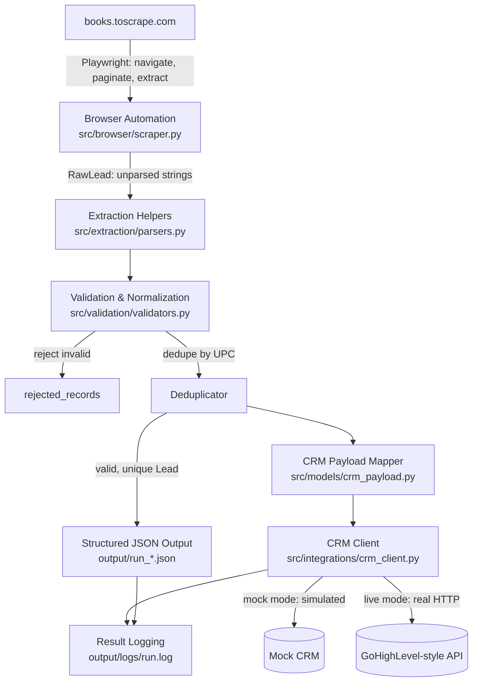

# AI-Assisted Browser Automation → CRM Sync (Playwright Demo)

A working, end-to-end demonstration of an AI-assisted browser automation
bot: it drives a real Chromium browser through a public website, extracts
structured records, validates and deduplicates them, writes clean JSON, and
synchronizes them to a GoHighLevel-style CRM API client with retry logic
and structured logging.

This is a portfolio work sample, not a tutorial. It's built the way a
production integration would be structured, at a scale appropriate for a
demo: real Playwright automation, real validation logic, a real (mocked)
CRM client, real tests, and a real execution log — not pseudocode.

**At a glance:**

- Python 3.9 + Playwright (async) browser automation
- Multi-page structured extraction (listing pages + per-record detail pages)
- A standalone validation / normalization / deduplication layer
- A GoHighLevel-style CRM/API integration client (mock mode by default, live mode implemented)
- Retry-with-backoff and per-stage error handling — one bad record never aborts the run
- Structured, stage-tagged logging plus a JSON run summary
- 35 passing automated tests (`pytest`)
- Built with **Claude Code** as an AI-assisted engineering copilot (see [AI-Assisted Development Workflow](#ai-assisted-development-workflow))

## Demo / Execution Evidence

The screenshot and JSON below were produced by an actual successful run of
`python main.py` against the live site — nothing here is mocked or
fabricated.



*Chromium mid-run, captured automatically by the bot itself
(`SCREENSHOT_SAVED` stage) while paginating the "Mystery" category.*

Full structured output from that same run: **[docs/sample-output.json](docs/sample-output.json)**
(25 validated records, 0 rejected, 0 duplicates, 25/25 CRM syncs
successful — see the `summary` block at the top of the file).

That CRM sync ran in the client's **mock mode** (`CRM_MODE=mock`, the
default) — no real GoHighLevel account was used or is required to
reproduce this. The live HTTP implementation (auth headers, retry-on-5xx,
GoHighLevel-shaped payload) exists and is covered by unit tests with the
HTTP layer mocked, but it was **not** exercised against a real CRM account
for this demo; see [Known limitations](#known-limitations).

## Problem being demonstrated

Clients who need lead/data pipelines typically want the same shape of
system: scrape or extract records from a web portal, clean and validate
them, avoid pushing duplicates, and land them in a CRM (frequently
GoHighLevel) via its API — reliably, with visibility into what happened
and why any given record failed. This project demonstrates that full
pipeline against a safe public target, with every stage independently
testable.

## The target site

[books.toscrape.com](https://books.toscrape.com) is a public sandbox built
by Zyte/Scrapinghub specifically for practicing web scraping. Its own
banner states: *"This is a demo website for web scraping purposes."* It
has no login wall, no CAPTCHA, no anti-bot measures, and no `robots.txt`
restricting automated access — it is exactly the kind of target that is
safe and legal to automate. It offers category filtering, multi-page
pagination, and a per-product detail page with a real stable unique ID
(UPC), which is what makes it a good stand-in for a real catalog/leads
portal.

Because the site's records are books, not people, the extracted data is
mapped onto a CRM "contact" schema as a demonstration of the *integration
shape* (see [Known limitations](#known-limitations)) — not as a claim that
real personal data was scraped.

## Architecture



Each stage is a separate, independently testable module:

```
src/
  browser/scraper.py       Playwright automation (async), yields RawLead
  extraction/parsers.py    Pure string-parsing helpers (no I/O)
  models/lead.py           RawLead / Lead / ValidationStatus dataclasses
  models/crm_payload.py    Lead -> GoHighLevel-style contact payload
  validation/validators.py Normalize, validate, deduplicate (no Playwright)
  integrations/crm_client.py  CRM API client: mock + live modes, retries
  config/settings.py       All tunables, loaded from environment
  logging/logger.py        Structured stage-tagged logging
  pipeline.py              Orchestrates the stages above end to end
main.py                    Entry point
tests/                     pytest suite for parsing/validation/CRM client
output/                    JSON run output + logs/run.log (gitignored)
screenshots/               PNG evidence captured during real runs (gitignored)
```

The browser layer only knows how to produce `RawLead` (unparsed strings).
The validation layer only knows how to turn a `RawLead` into a `Lead` or a
rejection — it has no Playwright or HTTP imports and is fully unit
testable. The CRM client only knows how to send a `CRMContactPayload` and
retry on transient failure. `pipeline.py` is the only module that wires all
of them together. This separation is what makes it possible to swap the
source site, the extraction selectors, or the CRM endpoint without
rewriting the rest of the system (see [Configuration](#configuration)).

## Technology stack

- Python 3.9, `asyncio`
- [Playwright](https://playwright.dev/python/) (async API) for browser automation
- [httpx](https://www.python-httpx.org/) for the live CRM HTTP client
- `python-dotenv` for environment-based configuration
- `pytest` + `pytest-asyncio` for tests
- Standard library `logging` with a structured, stage-tagged format

## How the browser automation works

`src/browser/scraper.py`'s `BookScraper`:

1. Launches Chromium (headless by default) via `async_playwright()`.
2. Navigates to a configurable category listing page.
3. Waits for `.product_pod, .alert` to appear via `page.wait_for_selector`
   — not a fixed `sleep()` — so it proceeds exactly as soon as the page is
   ready, and fails fast (logged, not crashed) if the page never loads.
4. Reads every listing card (`.product_pod`) on the page: title, price,
   availability, and rating are all present in the listing markup.
5. For each book, follows the detail page link to also capture the UPC
   (a real, stable unique identifier used for deduplication), full
   description, and category breadcrumb — demonstrating multi-page
   navigation, not just single-page scraping.
6. Follows `li.next a` to paginate, up to `MAX_PAGES`, until `MAX_RECORDS`
   is reached.
7. Saves a screenshot of the first listing page as durable proof of a real
   run (`screenshots/`, timestamped).
8. Closes the browser context/browser/Playwright instance in a `finally`
   block so resources are always released, even on error.

**Selector notes:** `.product_pod`, `.price_color`, `.availability`,
`.star-rating <Word>`, `.breadcrumb li a`, and the UPC table row are all
stable, semantic selectors on this site (verified directly against the
live DOM while building this project) rather than brittle
nth-child/generated-class selectors.

**Listing-only mode:** setting `FETCH_PRODUCT_DETAIL=false` skips the
per-book detail page entirely and extracts title/price/availability/rating
straight from the listing card, using the URL slug as the dedupe key
instead of a UPC. This trades the description/category/true-UPC fields for
roughly 7x fewer page loads — a real trade-off a client might want toggled
per use case.

## How data validation works

`src/validation/validators.py` — a pure, Playwright-free module:

- **Normalization:** whitespace-trims text, parses `"£45.17"` into
  `(45.17, "GBP")`, parses `"In stock (19 available)"` into
  `(True, 19)`, and maps the CSS rating class (`"Three"`) to an integer.
- **Validation:** rejects a record if the title is missing, the UPC is
  missing, or the price is missing/non-numeric/`<= 0`. Every rejection
  reason is recorded (a record can fail multiple checks at once) and
  written to `rejected_records` in the JSON output rather than silently
  dropped.
- **Deduplication:** a `Deduplicator` tracks UPCs seen so far in the run
  (case-insensitive) and skips repeats. Because the live source site has
  no real duplicate products, a live run typically shows
  `duplicates_skipped: 0` — that's the dataset being clean, not the logic
  being untested. The dedup and rejection logic itself is covered directly
  by unit tests with synthetic malformed/duplicate data
  (`tests/test_validation.py`).

## How CRM synchronization works

`src/integrations/crm_client.py`'s `CRMClient` models a
[GoHighLevel](https://www.gohighlevel.com/)-style contacts API
(`POST /contacts/`, bearer token, `locationId`, `customFields`, `tags`).

- **Mock mode (`CRM_MODE=mock`, the default):** no network calls at all.
  Simulates realistic latency and a configurable transient-failure rate
  (`CRM_MOCK_FAILURE_RATE`, default 20%) so the retry path is genuinely
  exercised on every run — you'll see `CRM_SYNC_RETRY` lines in the log —
  without needing real credentials.
- **Live mode (`CRM_MODE=live`):** sends a real `httpx` POST to
  `CRM_API_BASE_URL` with an `Authorization: Bearer <CRM_API_TOKEN>`
  header. `5xx`/`429` responses and connection errors are treated as
  transient and retried with exponential backoff
  (`CRM_RETRY_ATTEMPTS`, `CRM_RETRY_BACKOFF_SECONDS`); a `4xx` like `400`
  is treated as non-retryable and fails fast. This mode is fully
  implemented but was **not exercised against a real GoHighLevel account**
  for this demo — see [Known limitations](#known-limitations).
- Every attempt is logged (`CRM_SYNC_ATTEMPTED` / `_RETRY` /
  `_SUCCESS` / `_FAILURE`), and every record's sync outcome (success,
  attempts taken, status code) is written into the JSON output alongside
  the record itself.

## Reliability / error-handling approach

| Failure | Handling |
|---|---|
| Navigation timeout | Caught, logged, pagination stops gracefully — no crash |
| Missing/malformed DOM element | Each field read is independently try/excepted; a record missing a required field (title/UPC) is skipped and logged, the run continues |
| Invalid record (bad price, missing title) | Rejected by the validation layer, recorded in `rejected_records`, run continues |
| Duplicate record | Skipped via UPC-based dedup, counted, run continues |
| CRM transient failure (5xx/429/network) | Retried with exponential backoff up to `CRM_RETRY_ATTEMPTS` |
| CRM non-retryable failure (4xx) | Logged as a failure immediately, does not consume retry budget, run continues |
| Unexpected exception during CRM sync | Caught, logged, counted as a failure — does not crash the run |

One bad record never terminates the whole run — every stage that can fail
per-record catches its own errors and moves on, which is verified both by
the unit tests (synthetic bad data) and by an actual 404-category run
performed during development, which completed cleanly with
`discovered=0 extracted=0` instead of crashing.

## Security / secrets approach

- No secrets are hardcoded anywhere in the repository.
- `CRM_API_TOKEN`, `CRM_API_BASE_URL`, and `CRM_LOCATION_ID` are read only
  from the environment (`.env`, gitignored) via `src/config/settings.py`.
- `.env.example` documents every variable with safe defaults; the demo
  runs fully in mock mode with **zero** configuration required.
- The token is only ever placed into the `Authorization` header of the
  outbound live-mode HTTP request — it is never logged, never written to
  the JSON output, and never appears in a URL or query string.
- `.gitignore` excludes `.env`, virtualenvs, and per-run output/logs so a
  `git add` can't accidentally commit local secrets or noisy artifacts.

## Installation

Requires Python 3.9+.

```bash
python3 -m venv .venv
source .venv/bin/activate
pip install -r requirements.txt
python -m playwright install chromium
```

## How to run it

```bash
python main.py
```

By default this scrapes the "Mystery" category (2 pages, up to 25 books),
runs full validation/dedup, writes JSON to `output/`, saves a screenshot to
`screenshots/`, and syncs every valid record to the **mock** CRM client.
No API keys or configuration are required.

To change behavior, copy `.env.example` to `.env` and adjust — for example:

```bash
cp .env.example .env
# then edit TARGET_CATEGORY_SLUG, MAX_RECORDS, CRM_MODE, etc.
```

Everything in `.env.example` is documented inline.

## How to run tests

```bash
python -m pytest -v
```

35 tests cover price/availability/rating parsing, normalization and
validation rules, deduplication, GoHighLevel payload mapping, and the CRM
client's mock-mode and live-mode retry/failure behavior (the live-mode
tests mock the HTTP layer directly — no network access needed to run the
suite).

## Example output

A real run against the live site (`python main.py`), abridged:

```
2026-09-16T10:48:07-0400 | INFO     | BOT_STARTED              | run_id=run_20260916T144807Z target=https://books.toscrape.com category_slug=catalogue/category/books/mystery_3/index.html crm_mode=mock
2026-09-16T10:48:09-0400 | INFO     | PAGE_LOADED              | url=https://books.toscrape.com/catalogue/category/books/mystery_3/index.html page=1
2026-09-16T10:48:09-0400 | INFO     | SCREENSHOT_SAVED         | path=20260916T144809Z_listing_page1.png
2026-09-16T10:48:09-0400 | INFO     | RECORD_DISCOVERED        | cards_on_page=20
2026-09-16T10:48:09-0400 | INFO     | RECORD_EXTRACTED         | title='Sharp Objects' upc=e00eb4fd7b871a48
2026-09-16T10:48:09-0400 | INFO     | RECORD_VALIDATED         | upc=e00eb4fd7b871a48 title='Sharp Objects'
...
2026-09-16T10:48:13-0400 | WARNING  | CRM_SYNC_RETRY           | name='The Widow' attempt=1 reason=simulated_503 backoff=0.50s
2026-09-16T10:48:13-0400 | INFO     | CRM_SYNC_SUCCESS         | name='The Widow' attempt=2 status=201
...
2026-09-16T10:48:14-0400 | INFO     | BOT_COMPLETED            | discovered=32 extracted=25 rejected=0 duplicates=0 crm_success=25 crm_failure=0 duration_s=6.894 output=run_20260916T144807Z.json

============================================================
RUN SUMMARY
============================================================
Run ID:                 run_20260916T144807Z
Records discovered:     32
Records extracted:      25
Records rejected:       0
Duplicates skipped:     0
CRM sync successes:     25
CRM sync failures:      0
Total execution time:   6.894s
Output file:            /path/to/output/run_20260916T144807Z.json
============================================================
```

One JSON record from `output/run_20260916T144807Z.json`:

```json
{
  "extraction_timestamp": "2026-09-16T14:48:09.832030+00:00",
  "source": "books.toscrape.com",
  "record": {
    "source": "books.toscrape.com",
    "source_url": "https://books.toscrape.com/catalogue/sharp-objects_997/index.html",
    "title": "Sharp Objects",
    "price_amount": 47.82,
    "price_currency": "GBP",
    "in_stock": true,
    "stock_quantity": 20,
    "rating": 4,
    "category": "Mystery",
    "upc": "e00eb4fd7b871a48",
    "description": "WICKED above her hipbone, GIRL across her heart Words are like a road map to reporter Camille Preaker’s troubled past...",
    "scraped_at": "2026-09-16T14:48:09.832030+00:00",
    "validation_status": "valid",
    "validation_errors": []
  },
  "crm_sync": {
    "attempted": true,
    "success": true,
    "attempts": 1,
    "status_code": 201,
    "detail": "ok",
    "mode": "mock"
  }
}
```

## How this architecture could be adapted to GoHighLevel

Everything CRM-specific is isolated to two files:

- `src/models/crm_payload.py` — change `build_crm_payload()` to map real
  contact fields (name, email, phone) instead of the book-derived
  stand-ins, and adjust `to_api_dict()` if the target endpoint (contacts
  vs. opportunities vs. a custom object) expects a different shape.
- `src/integrations/crm_client.py` — set `CRM_MODE=live`,
  `CRM_API_BASE_URL` (GoHighLevel's is
  `https://services.leadconnectorhq.com`), `CRM_API_TOKEN`, and
  `CRM_LOCATION_ID` in `.env`. The retry/backoff/logging behavior already
  matches GoHighLevel's documented rate-limit (`429`) and `5xx` semantics.

No other module needs to change — the pipeline, validation, and logging
layers are CRM-agnostic by design.

## Known limitations

- **The source site has no real personal contact data.** To demonstrate
  the full "scrape → validate → push to CRM contact schema" pipeline
  without scraping or fabricating anyone's real personal information, each
  scraped *book* is mapped onto the CRM's *contact* schema (title →
  `name`, category → `companyName`, etc.). This is an intentional,
  disclosed substitution for demo purposes — a production deployment would
  map real lead/contact fields instead.
- **Live GoHighLevel mode is implemented but not credential-tested.** The
  live HTTP path (auth header, retry-on-5xx, error handling) is covered by
  mocked-HTTP unit tests, but this demo was not run against a real
  GoHighLevel account, since doing so would require real credentials this
  project deliberately avoids requiring.
- **The demo dataset is clean**, so a live run typically shows 0 rejected
  and 0 duplicate records. This reflects the source data, not untested
  logic — the rejection and dedup code paths are directly exercised by
  unit tests with synthetic bad/duplicate data.
- **No CI pipeline** is included; tests are run locally via `pytest`.
- **Single source, single site.** The scraper is specific to
  books.toscrape.com's DOM structure; adapting to a different portal means
  writing new selectors in `src/browser/scraper.py` (the rest of the
  pipeline is unaffected).

## Future extensions

- Add a second source adapter (implementing the same `RawLead`-yielding
  interface) to show the pipeline consuming multiple sites.
- Add a `--dry-run` CLI flag and argument parsing instead of only
  environment-variable configuration.
- Persist a rolling dedup index across runs (currently dedup is per-run
  only), e.g. to a local SQLite file or the CRM's own lookup API.
- Add a GitHub Actions workflow running `pytest` (and optionally a
  scheduled live scrape) on push.
- Swap the mock CRM's simulated failures for a local HTTP stub server to
  test the live-mode code path end-to-end without a real account.

## AI-Assisted Development Workflow

This project was built using **Claude Code** as an engineering copilot,
following a deliberate, verifiable workflow rather than "generate code and
assume it works":

1. **Requirements and acceptance criteria** — translated the brief into
   concrete deliverables (working pipeline, real execution evidence, tests,
   docs) before writing code.
2. **Architecture planning** — chose books.toscrape.com as the target
   (verified live via a browser tool: category structure, pagination,
   product detail fields, CSS selectors) and laid out the layered module
   structure (browser / extraction / validation / integrations) before
   implementation, so each concern could be tested independently.
3. **Implementation** — wrote the browser automation, parsing, validation,
   CRM client, and orchestration layers, plus a pytest suite covering the
   non-browser logic.
4. **Execution** — installed dependencies and Chromium, then ran the
   pipeline against the live site.
5. **Inspect logs/errors** — the first live run revealed a real bug:
   pagination silently stopped after page 1 because the detail-page
   navigation left the browser `Page` on a product URL, so the "next page"
   selector query ran against the wrong page and always returned nothing.
6. **Diagnose root cause** — traced it to `_get_next_page_href` being
   called *after* the per-card detail-page loop had already navigated
   `page` away from the listing page.
7. **Modify implementation** — restructured the scraper to snapshot each
   listing card's data (including the "next page" link) *before* following
   any detail-page links, fixing the root cause rather than adding a
   workaround. Also found and fixed a listing-only mode (`FETCH_PRODUCT_DETAIL=false`)
   that was a dead stub returning nothing, and implemented it properly.
8. **Rerun** — re-ran the pipeline and confirmed pagination now correctly
   traversed both pages of the category (32 books discovered vs. 20
   before the fix).
9. **Regression testing** — reran the full `pytest` suite after each code
   change (35/35 passing throughout) and additionally exercised
   listing-only mode and a deliberately-broken category URL to confirm
   graceful error handling end to end.
10. **Documentation** — wrote this README, `PORTFOLIO.md`, and
    `DEMO_SCRIPT.md` from the actual verified run output above, not from
    assumed behavior.

## License

This is a portfolio work sample. Feel free to read and learn from it; ask
before reusing it commercially.
